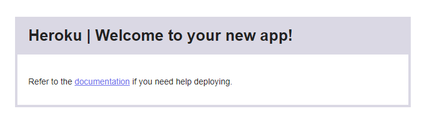

# Static Site Placeholder for Heroku

## Why You Might Need This

[Expedited WAF](https://elements.heroku.com/addons/expeditedwaf) on Heroku requires that a site return a 200 HTTP status code before setup can begin. 

Why? This helps with troubleshooting and setup by making sure that new sites are configured and functional prior to implementing the WAF. 

If you're launching a new site though you may wish to set up the WAF prior to launch. 

A Heroku application that:

1. Has not yet had any code deployed to it
2. Has DNS/Domains setup correctly 

Will return a 502 HTTP Status Code along with this page:

## How To Fix This

The quickest fix is to set up a static "coming soon" page that while functionally not different than the "Heroku | Welcome to your new app!" page will instead return a 200 HTTP Status code and let you proceed with WAF setup. 

This repo is exactly that and the deployed page will look like screenshot below:

Add this to your Heroku app by clicking on the Heroku deploy button below.

&nbsp;
&nbsp;
&nbsp;

&nbsp;

#### This will:

1. Deploy this static site + coming soon page into your Heroku app.
2. The app will then return a 200 HTTP status code
3. You can then proceed with WAF setup. 

## Support

Please email [support@expeditedsecurity.com](mailto:support@expeditedsecurity.com) if you need help getting this setup. 

